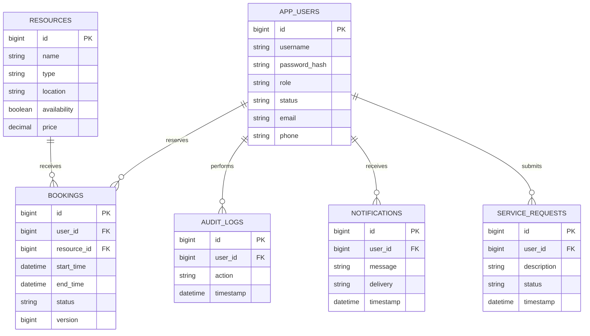

# CSRM data model

Relationships are validated by the service layer. IDs are stored as scalar columns; Hibernate does not create foreign-key constraints for these references. Users are retained, and resources are retired rather than deleted to preserve history.
